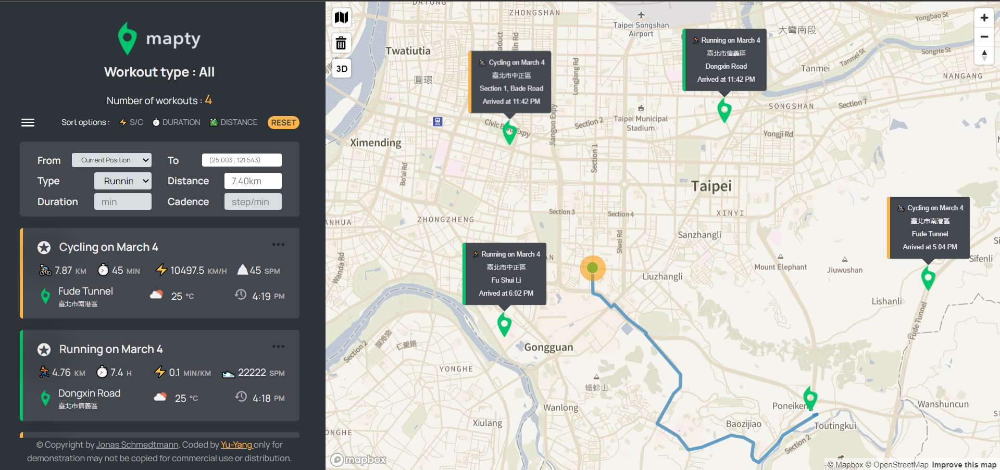

# Mapty with Yu-Yang

## Table of contents

- [Overview](#overview)
  - [App features](#app-features)
  - [Screenshot](#screenshot)
  - [Links](#links)
- [My process](#my-process)
  - [Built with](#built-with)
  - [What I learned](#what-i-learned)
- [Author](#author)
- [License](#license)

## Overview

### App features

- Double click map to add Cycling or Running workout on map.
- Each workout can edit ,delete and marking as favorites workout.
- When creating or editing user can **drag mark icon** to set start and end point.
- When user drag on mark icon, **auto calculating distance** between start and end point coordinates and displaying on form input.
- After creating workout it will get **weather temperature, location address,duration,and workout time data** on workout card.
- User can view workouts by certain **categories(cycling ,running ,favorites)**
- User can sort workouts by certain **fields(distance ,duration ,speed/cadence)**
- When click on each workout map will auto **show the path** on map.
- **User can click icon on map to show all workouts,delete all workouts,and transforming 2D view to 3D view.**
- Mapbox origin zoom in out functionality on map.

### Screenshot

### Links

- Live Site URL: [Live site of the challenge hosted here](https://mapty-yuyang.netlify.app/)

## My process

### Built with

- Semantic HTML5 markup
- CSS custom properties
- Sass preprocessor
- [Parcel](https://parceljs.org/), [Babel](https://babeljs.io/)
- Generate map from [mapbox](https://www.mapbox.com/) library
- Weather data and icons from [OpenWeatherMap](https://openweathermap.org/) API
- GeoCode location data from [geocode.xyz](https://geocode.xyz/) API
- Icons from [icomoon.io](https://icomoon.io/)
- Deploy by [netlify.com](https://www.netlify.com/)

### What I learned

Learing to implement **MVC structure** to learn backend file structure, using multiple third party API library,and using parcel to bundle

## Author

- Website - Well I haven't made my profile portfolio, gonna make it sooon when I know a lot of stuffs
- Yu-Yang - [@jasons0900107315@gmail.com](https://www.google.com/gmail/about/)

## License

Make sure you know that **This project is based on [Jonas Schmedtmann](https://github.com/jonasschmedtmann)'s [Mapty](https://mapty.netlify.app/) project.**
